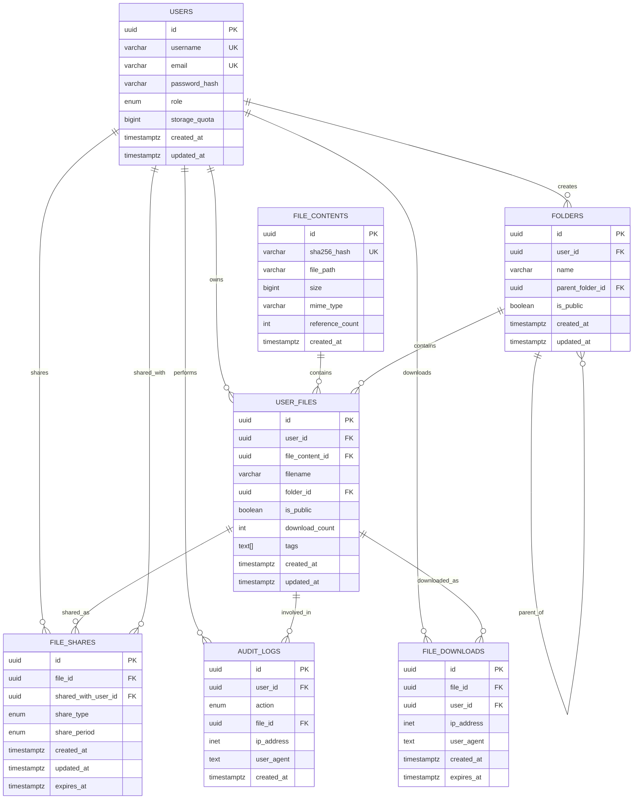

# Entity Relationship (ER) Diagram - File Vault Database

## Database Schema Overview

The File Vault application uses PostgreSQL as the primary database with the following core entities and relationships.

## ER Diagram

## Indexes

### Primary Indexes
- All tables have primary key indexes on `id` fields

### Unique Indexes
- `users.username` (unique)
- `users.email` (unique)
- `file_contents.sha256_hash` (unique)

### Performance Indexes
- `user_files.user_id` (frequent queries by user)
- `user_files.file_content_id` (file content lookups)
- `user_files.folder_id` (folder contents)
- `user_files.is_public` (public file queries)
- `file_shares.file_id` (file sharing lookups)
- `file_shares.shared_with_user_id` (user's shared files)
- `audit_logs.user_id` (user activity)
- `audit_logs.created_at` (time-based queries)

## Constraints

### Foreign Key Constraints
- `user_files.user_id` → `users.id` (CASCADE DELETE)
- `user_files.file_content_id` → `file_contents.id` (CASCADE DELETE)
- `user_files.folder_id` → `folders.id` (CASCADE DELETE)
- `folders.user_id` → `users.id` (CASCADE DELETE)
- `folders.parent_folder_id` → `folders.id` (CASCADE DELETE)
- `file_shares.file_id` → `user_files.id` (CASCADE DELETE)
- `file_shares.shared_with_user_id` → `users.id` (CASCADE DELETE)
- `audit_logs.user_id` → `users.id` (CASCADE DELETE)
- `audit_logs.file_id` → `user_files.id` (CASCADE DELETE)
- `file_downloads.file_id` → `user_files.id` (CASCADE DELETE)
- `file_downloads.user_id` → `users.id` (CASCADE DELETE)

### Check Constraints
- `users.storage_quota >= 0`
- `file_contents.size > 0`
- `file_contents.reference_count >= 0`
- `user_files.download_count >= 0`
- `audit_logs.created_at <= NOW()`
- `file_downloads.created_at <= NOW()`

## Triggers

### Update Timestamps
- `update_users_updated_at`: Updates `updated_at` on user changes
- `update_user_files_updated_at`: Updates `updated_at` on file changes
- `update_folders_updated_at`: Updates `updated_at` on folder changes
- `update_file_shares_updated_at`: Updates `updated_at` on share changes

### Storage Quota Management
- `update_storage_quota`: Automatically updates user storage quota when file reference counts change

## Data Integrity

### Referential Integrity
- All foreign key relationships are enforced
- Cascade deletes ensure data consistency
- Orphaned records are automatically cleaned up

### Business Logic Integrity
- File deduplication through SHA256 hashing
- Reference counting prevents premature file deletion
- Storage quota enforcement
- Share expiration handling

### Security Integrity
- Password hashing with bcrypt
- Audit trail for all user actions
- IP address and user agent tracking
- Secure file path storage
