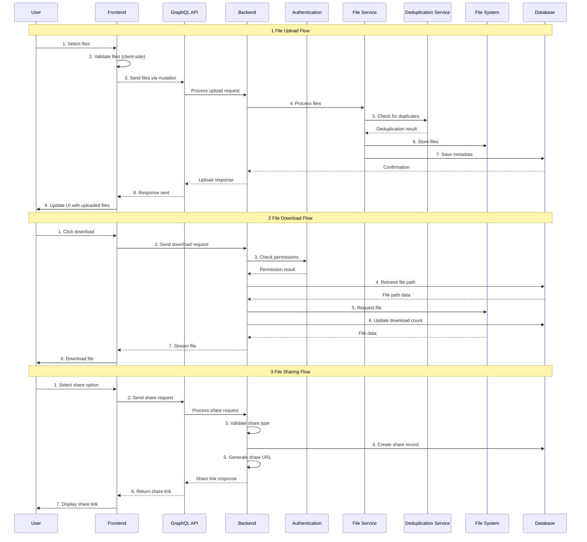

# High-Level Design (HLD) - File Vault Application

## 1. System Overview

File Vault is a secure cloud storage application that allows users to upload, manage, and share files with advanced features like deduplication and access control.

## 2. Architecture Overview

### 2.1 System Architecture
```
                        ┌─────────────────┐    ┌─────────────────┐    ┌─────────────────┐
                        │   Frontend      │    │   Backend       │    │   Database      │
                        │   (Next.js)     │◄──►│   (Go + GraphQL)│◄──►│   (PostgreSQL)  │
                        │                 │    │                 │    │                 │
                        │ - React UI      │    │ - GraphQL API   │    │ - User Data     │
                        │ - Apollo Client │    │ - HTTP Routes   │    │ - File Metadata │
                        │ - Tailwind CSS  │    │ - File Service  │    │ - File Contents │
                        └─────────────────┘    └─────────────────┘    └─────────────────┘
                                                         │                       │
                                                         │                       │
                                                         ▼                       ▼
                                               ┌─────────────────┐    ┌─────────────────┐
                                               │   Redis Cache   │    │   File System   │
                                               │ (Rate Limiting) │    │     (Local)     │
                                               └─────────────────┘    └─────────────────┘
```

## 2. Data Flow




### 3. Technology Stack

**Frontend:**
- Next.js 14 (React Framework)
- Apollo Client (GraphQL Client)
- Tailwind CSS (Styling)
- TypeScript (Type Safety)

**Backend:**
- Go (Programming Language)
- GraphQL (API Layer)
- GQLGen (Code Generation)

**Database:**
- PostgreSQL (Primary Database)
- Redis (Rate Limiting)

**Infrastructure:**
- Docker & Docker Compose
- Nginx (Reverse Proxy)
- File System Storage


## 4. Security Architecture

### 4.1 Authentication & Authorization
- **JWT Tokens**: Stateless authentication
- **Password Security**: Bcrypt hashing

### 4.2 Data Protection
- **Access Control**: Granular permission system
- **Audit Logging**: User action tracking
- **CORS Protection**: Cross-origin request security

### 4.3 Storage Security
- **File Deduplication**: Secure hash-based deduplication
- **Path Sanitization**: Prevent directory traversal
- **MIME Type Validation**: File type verification
- **Size Limits**: File size restrictions

## 5.1 Performance Optimization
- **Caching Strategy**: Redis for frequently accessed data
- **File Compression**: Automatic file compression
- **Lazy Loading**: On-demand data loading
- **Pagination**: Large dataset handling

### 5.2 Storage Optimization
- **Deduplication**: Reduce storage requirements
- **Storage Quotas**: User storage limits

## 6. Monitoring & Logging

### 6.1 Application Monitoring
- **Health Checks**: Service availability monitoring
- **Performance Metrics**: Response time tracking
- **Error Tracking**: Exception monitoring
- **Usage Analytics**: User behavior tracking

### 6.2 Audit Trail
- **User Actions**: Login, upload, download, delete
- **File Operations**: Share, unshare, modify
- **System Events**: Errors, warnings, info
- **Security Events**: Failed logins, suspicious activity

